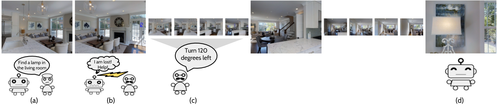

# Vision-based Navigation with Language-based Assistance via Imitation Learning with Indirect Intervention

Authors: [Khanh Nguyen](https://khanhptnk.github.io), [Debadeepta Dey](http://www.debadeepta.com/), [Chris Brockett](https://www.microsoft.com/en-us/research/people/chrisbkt/), [Bill Dolan](https://www.microsoft.com/en-us/research/people/billdol/).

This repo contains code and data-downloading scripts for the paper [Vision-based Navigation with Language-based Assistance via Imitation Learning with Indirect Intervention](https://arxiv.org/abs/1812.04155). We present Vision-based Navigation with Language-based Assistance (VNLA, pronounced as *"Vanilla"*), a grounded vision-language task where an agent with visual perception is guided via language to find objects in photorealistic indoor environments. 

### Development system	

Our instructions assume the followings are installed:

* Ubuntu 18.04 LTS 
* [Anaconda Python 2.7](https://www.anaconda.com/download/#linux)
* [PyTorch 0.4.1 with CUDA 9.0](https://pytorch.org/get-started/previous-versions/)

See [setup simulator](https://github.com/debadeepta/learningtoask/tree/master/code) for packages required to install the Matterport3D simulator.

The Ubuntu requirement is not mandatory. As long as you can sucessfully Anaconda, PyTorch and other required packages, you are good!

### Let's run the code!

0. Clone this repo `git clone git@github.com:debadeepta/vnla.git`. 
1. [Download data](https://github.com/debadeepta/learningtoask/tree/master/data). 
2. [Setup simulator](https://github.com/debadeepta/learningtoask/tree/master/code). 
3. [Run experiments](https://github.com/debadeepta/learningtoask/tree/master/code/tasks/VNLA). 

Please create Github issues or email kxnguyen@cs.umd.edu, dedey@microsoft.com for any questions or feedback. 

