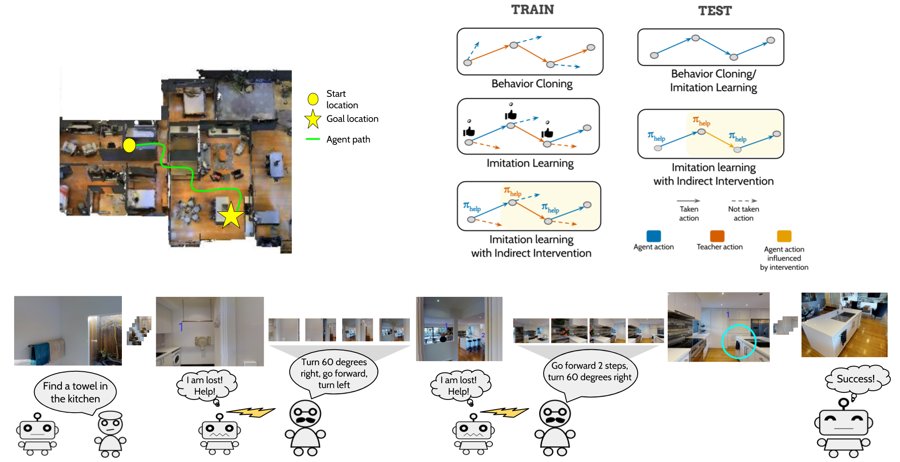
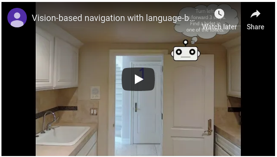

# NUS-CP3106
<b>AY 2019/2020 Semester II</b>.  
<b>By Yuxuan</b>.  
See report [here](NUS_CP3106_REPORT_YUXUAN.pdf).  
See video demo [here](https://youtu.be/E7eLIXqEhCQ).  

## Disclaimer
This work is an extension on Nguyen, Khanh, et al. “Vision-Based Navigation With Language-Based Assistance via Imitation Learning With Indirect Intervention.” <i>2019 IEEE/CVF Conference on Computer Vision and Pattern Recognition (CVPR)</i>, 2019, doi:10.1109/cvpr.2019.01281. Github repo at https://github.com/debadeepta/vnla.

## To re-run our experiment
1) Clone the repo from the original work at [here](https://github.com/debadeepta/vnla).  
2) Follow along the steps to:  
  a) [download data](https://github.com/debadeepta/vnla/tree/master/data).  
  b) [setup simulator](https://github.com/debadeepta/vnla/tree/master/code).   
3) After you are done, copy our [VNLA](VNLA) folder in this repo and overwrite to the orginal repo. Also add [verbal_qa_vocab.txt](asknav/verbal_qa_vocab.txt) to the corresponding folder of original repo.
```
$ cp -r VNLA root_dir/code/tasks/VNLA/
$ cp asknav/verbal_qa_vocab.txt root_dir/data/asknav/.
```
4) Run experients at root_dir/code/tasks/VNLA/scripts/
```
training:
$ bash train_main_results.sh [learned|none] [gpu id]
example: $ bash train_main_results.sh learned 0

evaluation:
$ bash eval_main_results.sh [learned|none] [seen|unseen] [gpu id]
example: $ bash eval_main_results.sh learned seen

no room experiment:
$ bash train_noroom.sh noroom_learned [gpu id]
$ bash eval_noroom.sh noroom_learned [seen|unseen]
```
Note that baselines "random" and "first" in the original work are not implemented in our work, errors may be encountered. Rule ablation study is also not carried out.


# Vision-based Navigation with Language-based Assistance via Imitation Learning with Indirect Intervention

[](https://opensource.org/licenses/MIT)  

Authors: [Khanh Nguyen](https://khanhptnk.github.io), [Debadeepta Dey](http://www.debadeepta.com/), [Chris Brockett](https://www.microsoft.com/en-us/research/people/chrisbkt/), [Bill Dolan](https://www.microsoft.com/en-us/research/people/billdol/).

This repo contains code and data-downloading scripts for the paper [Vision-based Navigation with Language-based Assistance via Imitation Learning with Indirect Intervention](https://arxiv.org/abs/1812.04155) (CVPR 2019). We present Vision-based Navigation with Language-based Assistance (VNLA, pronounced as *"Vanilla"*), a grounded vision-language task where an agent with visual perception is guided via language to find objects in photorealistic indoor environments. 


<p align="center">
<a href="https://www.youtube.com/watch?v=Vp6C29qTKQ0&feature=youtu.be" target="_blank"></a>
</p>


### Development system	

Our instructions assume the followings are installed:

* Ubuntu 18.04 LTS 
* [Anaconda Python 3.6](https://www.anaconda.com/download/#linux)
* [PyTorch 1.0.1 with CUDA 10.0](https://pytorch.org/)

See [setup simulator](https://github.com/debadeepta/learningtoask/tree/master/code) for packages required to install the Matterport3D simulator.

The Ubuntu requirement is not mandatory. As long as you can sucessfully Anaconda, PyTorch and other required packages, you are good!


### Let's play with the code!

0. Clone this repo `git clone --recursive https://github.com/debadeepta/vnla.git` (don't forget the `recursive` flag!)
1. [Download data](https://github.com/debadeepta/learningtoask/tree/master/data). 
2. [Setup simulator](https://github.com/debadeepta/learningtoask/tree/master/code). 
3. [Run experiments](https://github.com/debadeepta/learningtoask/tree/master/code/tasks/VNLA). 
4. [Extend this project](https://github.com/debadeepta/vnla/tree/master/code/tasks/VNLA#extend-this-project). 


Please create a Github issue or email kxnguyen@cs.umd.edu, dedey@microsoft.com for any question or feedback. 

### FAQ

Q: *What's the difference between this task and the [Room-to-Room](https://bringmeaspoon.org/) task?*

A: In R2R, the agent's task is given by a **detailed** language instruction (e.g., "Go the table, turn left, walk to the stairs, wait there"). The agent has to execute the instruction **without additional assistance**. 

In VNLA (our task), the task is described as a **high-level end-goal** (the steps for accomplishing the task are _not_ described) (e.g., "Find a cup in the kitchen"). The agent is capable of **actively requesting additional assistance** (in the form of language subgoals) while trying to fulfill the task. 

### Citation

If you want to cite this work, please use the following bibtex code

```
@InProceedings{nguyen2019vnla,
author = {Nguyen, Khanh and Dey, Debadeepta and Brockett, Chris and Dolan, Bill},
title = {Vision-Based Navigation With Language-Based Assistance via Imitation Learning With Indirect Intervention},
booktitle = {The IEEE Conference on Computer Vision and Pattern Recognition (CVPR)},
month = {June},
year = {2019}
}
```


